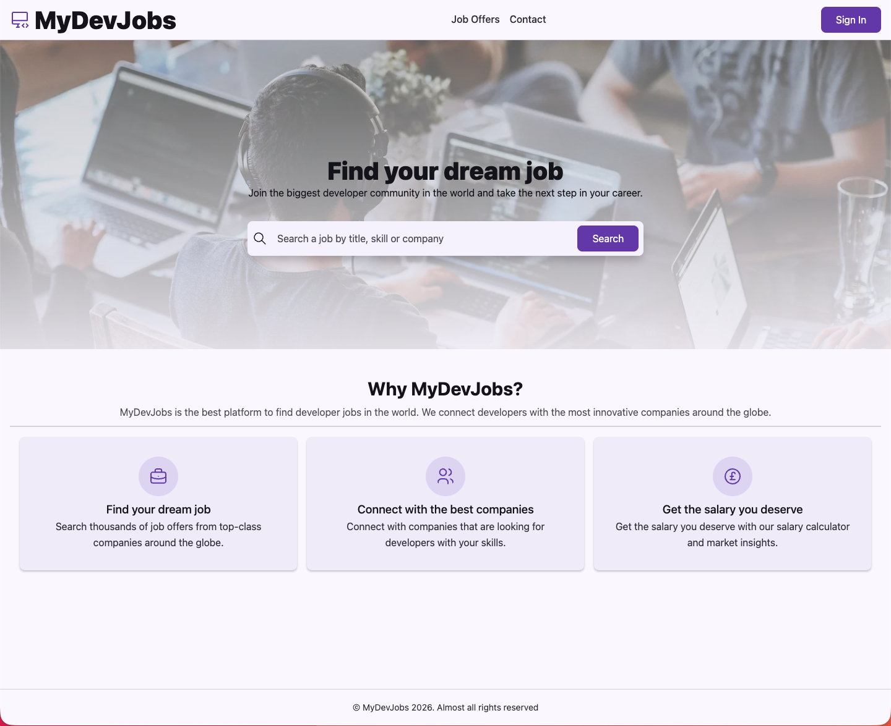

  <h1>JS Camp</h1>
  

    A step-by-step learning project that moves from the very basics to a complete
    full stack application, including an artificial intelligence workspace.
  

  

    
    
    
    
    
    
    
    
  

  

## Overview

This repository groups the project in multiple stages, starting with plain HTML/CSS/JS,
progressing toward a full stack build, and extending into an artificial intelligence
workspace with separate frontend and backend apps. Each folder represents a milestone
with its own README and setup instructions. It documents my learning process with React
coming from a Vue background, following the JSCamp path.

## Structure

- `static-minimal-version/`: the pure HTML/CSS/JS prototype (no build step)
- `react-first-steps/`: early React steps
- `react/`: the main React version using Vite
- `react-router-and-zustand/`: routing and shared state iteration with React Router and Zustand
- `node-intro/`: Node.js fundamentals, CLI exercises, and a small native HTTP server
- `express/`: the backend API layer with routes, validation, and tests
- `testing/`: end-to-end testing experiments with Playwright and Stagehand
- `artificial-intelligence/`: AI-focused workspace with dedicated frontend and backend apps,
  plus standalone examples

## Goal

- Learn by iteration, from fundamentals to a complete app
- Keep each stage isolated and documented
- Make it easy to compare approaches and evolution over time
- Explore how AI features fit into a modern JavaScript full stack project

## Next Steps

- Add a database layer to move beyond in-memory or file-based data handling
- Add proper authentication and authorization flows across the app
- Explore CI/CD to automate testing, builds, and delivery
- Containerize the project with Docker for consistent local and deployment environments

## Kudos

- Huge thanks to <a href="https://jscamp.dev" rel="noopener noreferrer">JSCamp</a> and <a href="https://midu.dev" rel="noopener noreferrer">Midudev</a> for building an outstanding free learning platform.
